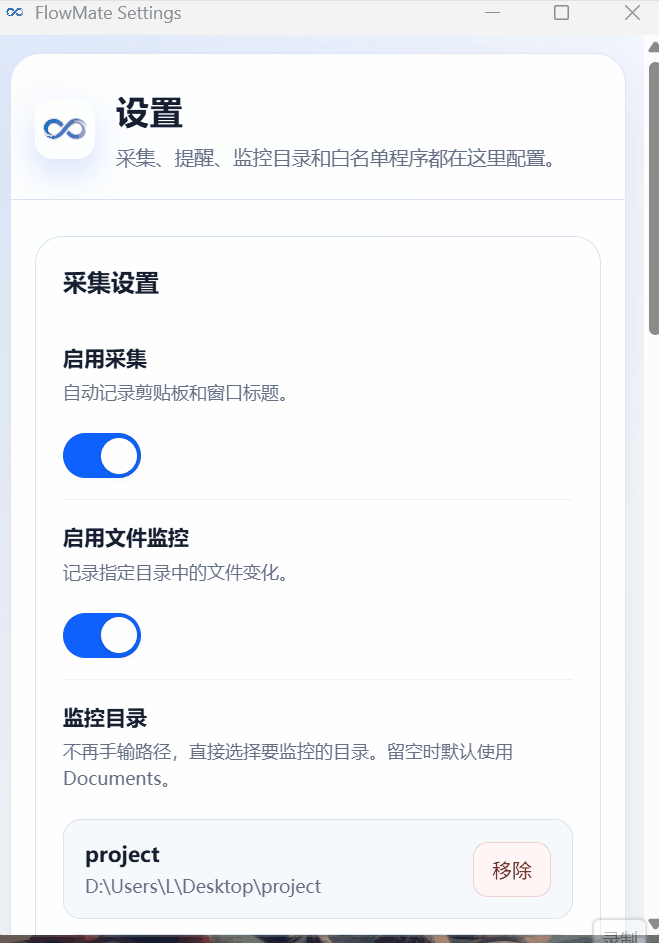

# FlowMate

自动化工作日报生成工具。

## 功能特点

- 自动采集工作活动（剪贴板、窗口标题、文件操作）
- AI 智能生成结构化日报
- 全局快捷键一键生成
- 定时提醒
- 本地数据存储，保护隐私

## 效果演示

## 下载试用

前往 [Releases](https://github.com/cliu-debug/flowmate-docs/releases) 下载最新安装包。

## 使用文档

- [用户使用指南](用户使用指南.md)

## 系统要求

- Windows 10/11 (64-bit)

## 反馈与建议

如有问题或建议，欢迎联系：liuc8740@gmail.com

## 版本

当前版本：1.0.0